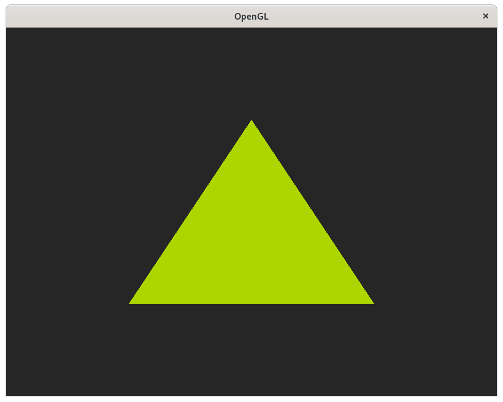

# x11-opengl
Initialization of OpenGL using X11 and GLX. Check out this [post](https://www.alexvia.com/initializing_opengl_on_x11/)
for a walkthrough of the code.

## Quickstart
Dependencies:
- C compiler (I will be using gcc)
- pkg-config
- X11 and GL development packages (may vary depending on your distribution)

To compile just run:
```
gcc -o x11_opengl `pkg-config --libs x11 gl` x11_opengl.c
```

And here's the result:


